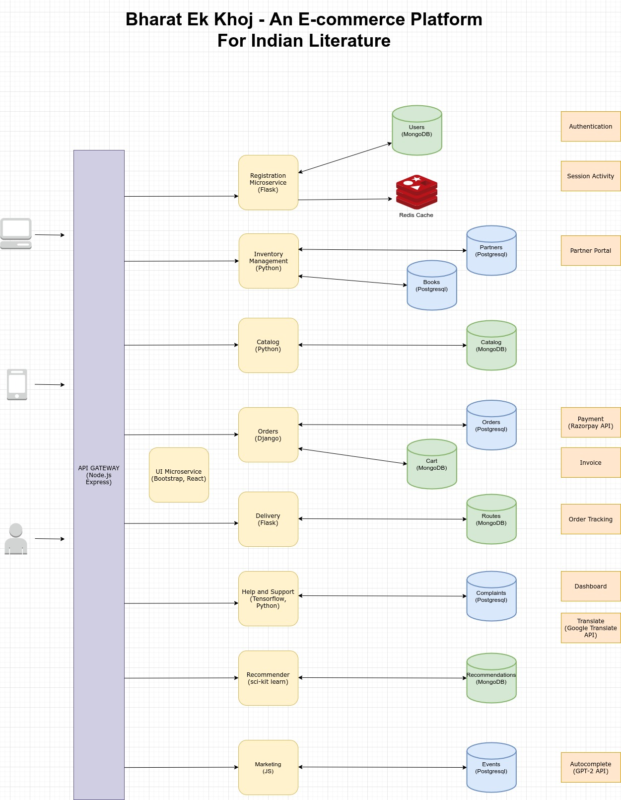

# Bharat Ek Khoj- An E-commerce platform for Indian Literature

* Microservices
  * Registration
  * Inventory Management
  * Catalog
  * Orders
  * Delivery
  * Help and Support
  * Recommender System
  * Marketing
  * UI

* Create a Folder for each Microservice, and maintain a separate README for it.

* Try to maintain the wiki page documenting any contributions made.

* Update this README.md when work on any microservice gets completed.